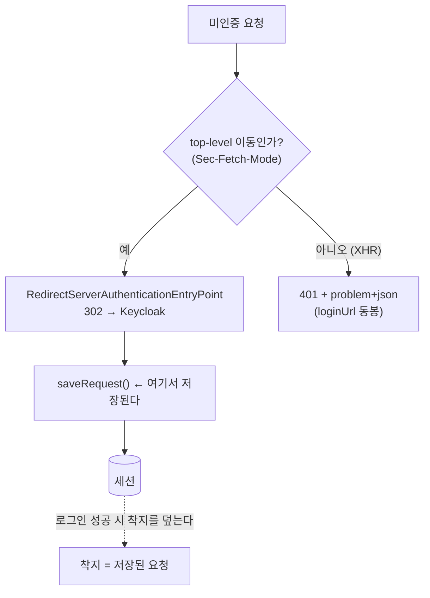
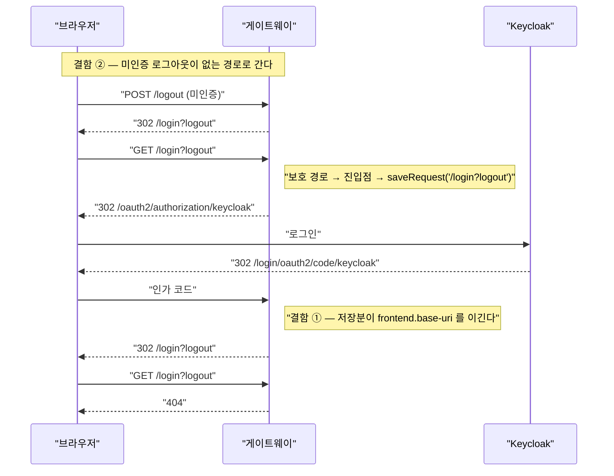

# 42. 설정은 맞는데 조용히 무력화된다 — alpha 에서만 드러난 두 개의 침묵 실패

> 값을 올바르게 넣었는데 **다른 것이 그 값을 이겨서** 무효가 되는 부류가 있다. 컴파일도 기동도
> 로그도 전부 정상이라, 설정을 아무리 들여다봐도 원인이 안 보인다.
> 관련: Phase 9 · 커밋 `6af7e14` · 코드 `gateway/src/main/kotlin/me/ramos/unigate/adapter/gatewayIn/AuditingAuthenticationHandlers.kt` ·
> `samples/frontend-demo/src/api/client.ts`

---

## 1. 왜 필요했나

alpha 에 FE 를 분리 배포한 뒤 두 가지가 관찰됐다.

1. **로그인은 성공하는데 게이트웨이의 `/login?logout` 으로 착지해 404.**
   `UNIGATE_FRONTEND_BASE_URI` 는 파드 2개 모두 정상 주입돼 있었다.
2. **로그아웃 버튼 첫 클릭만 403.** 새로고침하고 다시 누르면 성공한다.

둘 다 "설정을 안 넣었나?" 를 먼저 의심하게 만드는데, **설정은 처음부터 맞았다.** 값이 있는데도
다른 메커니즘이 그 값을 이기고 있었다. 이 문서는 그 공통 구조를 정리한다.

로컬에서는 **둘 다 재현되지 않는다.** ①은 same-origin(Vite dev proxy)에서 `/` 도 `/login?logout` 도
전부 FE 로 프록시되기 때문이고, ②는 순차 호출로는 경쟁이 성립하지 않기 때문이다.

## 2. 익숙한 방식과의 대조

| | 익숙한 방식 | 여기서 벌어진 일 | 왜 다른가 |
|---|---|---|---|
| 설정 주입 | `@Value` 로 넣으면 그 값이 쓰인다 | 넣은 값이 **조건부로만** 쓰인다 | 프레임워크가 `defaultIfEmpty(내값)` 구조라 앞의 값이 있으면 내 값은 버려진다 |
| 설정 적용 범위 | 빌더에 설정하면 하위 컴포넌트에 전파된다 | **내가 `new` 한 객체에는 안 간다** | 빌더는 자기가 만든 것에만 주입한다 |
| 토큰 발급 | 한 번 받으면 그 값이 유지된다 | 다른 응답이 **쿠키를 덮어쓴다** | 서버가 "쿠키 없는 요청"마다 새로 만든다 |
| 실패 관측 | 로그·예외로 드러난다 | 로그가 **완전히 깨끗하다** | 정상 동작의 조합이라 어디서도 오류가 아니다 |

## 3. 동작 원리

### 3.1 결함 ① — 저장된 요청이 착지를 이긴다

`RedirectServerAuthenticationSuccessHandler` 의 실제 구현은 이렇다.

```
requestCache.getRedirectUri(exchange).defaultIfEmpty(this.location).flatMap(::sendRedirect)
```

즉 `setLocation()` 으로 넣은 값은 **저장된 요청이 없을 때만** 쓰인다.

그럼 누가 저장하나. unigate 의 진입점 `ProblemDetailAuthenticationEntryPoint` 는 **분기형**이다.



기존 KDoc 은 *"진입점이 401 + loginUrl 을 주는 방식이라 원래 요청을 저장하지 않는다"* 고 단정하고
있었다. **401 분기만 보고 내린 오독이었고, 그 문장이 이번 버그를 놓치게 만든 직접 원인이다.**

### 3.2 그럼 무엇이 저장됐나 — 결함이 하나 더 있었다

저장된 값은 `/login?logout` 이었다. 그 경로가 어떻게 생겼는가:

`OidcClientInitiatedServerLogoutSuccessHandler.setPostLogoutRedirectUri` 는 **OIDC 사용자로 인증돼
있을 때만** 쓰인다. 미인증 로그아웃(시크릿 창, 세션 만료 뒤 버튼)은 위임체
`RedirectServerLogoutSuccessHandler` 의 기본값 `/login?logout` 으로 간다.

그 경로는 이 게이트웨이에 **존재하지 않는다**(BFF 라 로그인 페이지를 서빙하지 않는다). 게다가
공개 경로도 아니라 인증 진입점에 걸려 302 → 저장된다.



**두 결함이 연쇄해야만 드러난다.** 각각 단독으로는 무해해 보인다 — ②만 있으면 "로그아웃 후 404"
라는 사소한 문제이고, ①만 있으면 저장될 것이 없어 아무 일도 안 일어난다.

### 3.3 결함 ③ — CSRF 토큰 쿠키가 덮인다

게이트웨이는 `XSRF-TOKEN` 쿠키가 **없는** 요청마다 새 토큰을 만들어 쿠키로 내린다. 쿠키가 없는
첫 화면에서 두 요청이 동시에 나가면:

```
/csrf   → 본문 T1 · 쿠키 T1     ← 로그아웃 폼은 T1 을 들고 있다
whoami  → (응답이) 쿠키 T2       ← 쿠키가 T2 로 덮인다
POST /logout  _csrf=T1 + 쿠키 T2 → double-submit 불일치 → 403
```

새로고침하면 쿠키가 이미 있어 두 요청이 그것을 재사용하므로 덮어쓰기가 없다 → 성공. 그래서
**"첫 시도만 403"** 이라는 형태가 된다.

## 4. 직접 확인한 것

### 4.1 브라우저 HAR — 연쇄 전체가 찍혔다

사용자가 시크릿 창에서 로그인한 뒤 내려받은 HAR 을 파싱했다.

```bash
python3 -c "
import json,re
h=json.load(open('<다운로드한 HAR 경로>'))
...  # method / status / Location 만 추출, code·state 는 마스킹
"
```

실제 출력(자산 요청 생략, 호스트는 마스킹):

```
[07] POST 302 https://<gw>/logout
         -> Location: /login?logout
[08] GET  302 https://<gw>/login?logout
         -> Location: /oauth2/authorization/keycloak
[56] POST 302 https://<kc>/realms/unigate/login-actions/authenticate?session_code=<masked>
         -> Location: https://<gw>/login/oauth2/code/keycloak?state=<masked>&...
[57] GET  302 https://<gw>/login/oauth2/code/keycloak?state=<masked>
         -> Location: /login?logout          ← 착지가 덮였다
[58] GET  404 https://<gw>/login?logout
```

### 4.2 설정은 정상이었다

```bash
for p in $(kubectl -n unigate get pods -l app.kubernetes.io/name=unigate-gateway -o name); do
  echo -n "$p: "
  kubectl -n unigate exec "$p" -- sh -c 'echo "${UNIGATE_FRONTEND_BASE_URI:+SET}${UNIGATE_FRONTEND_BASE_URI:-EMPTY}"'
done
```

```
pod/unigate-gateway-deploy-77f59f8474-4l7xj: SEThttps://<console-host>/
pod/unigate-gateway-deploy-77f59f8474-tn6qq: SEThttps://<console-host>/
```

**값은 두 파드 모두 맞았다.** 여기서 설정 의심을 접고 코드로 갔다.

### 4.3 바이트코드로 "저장분이 이긴다"를 확인

문서가 아니라 실제 구현을 봤다.

```bash
javap -p -c .../RedirectServerAuthenticationSuccessHandler.class | grep -E "getRedirectUri|defaultIfEmpty"
```

```
10: invokeinterface  // InterfaceMethod ...ServerRequestCache.getRedirectUri:(...)Lreactor/core/publisher/Mono;
16: getfield         // Field location:Ljava/net/URI;
19: invokevirtual    // Method reactor/core/publisher/Mono.defaultIfEmpty:(Ljava/lang/Object;)Lreactor/core/publisher/Mono;
```

그리고 저장하는 쪽:

```bash
javap -p -c .../RedirectServerAuthenticationEntryPoint.class | grep -E "saveRequest|sendRedirect"
```

```
 5: invokeinterface  // InterfaceMethod ...ServerRequestCache.saveRequest:(...)Lreactor/core/publisher/Mono;
19: invokeinterface  // InterfaceMethod ...ServerRedirectStrategy.sendRedirect:(...)Lreactor/core/publisher/Mono;
```

### 4.4 회귀 테스트가 수정 전에 실패하는 것을 먼저 확인했다

동작 변경 두 줄만 임시로 비활성화하고 돌렸다.

```bash
./gradlew :gateway:test --tests '*GatewaySecurityIntegrationTest*' --tests '*PostAuthLandingTest*'
```

```
26 tests completed, 2 failed
```

실패 내용:

```
java.lang.AssertionError:
Expecting actual:
  "/login?logout"
not to start with:
  "/login"
    at ...GatewaySecurityIntegrationTest.미인증_로그아웃은_존재하지_않는_login_이_아니라_착지_URI_로_보낸다

org.opentest4j.AssertionFailedError: [미인증 302 응답이 세션을 만들었다 = 요청이 저장됐다는 뜻]
expected: null
 but was: SESSION=1f885b1f-9cb6-4b0b-b981-24213d225ae4; Path=/; HttpOnly; SameSite=Lax
    at ...GatewaySecurityIntegrationTest.미인증 브라우저 이동은 세션을 만들지 않는다
```

첫 실패값 `/login?logout` 은 **HAR 의 값과 정확히 같다.**

### 4.5 `http.requestCache { }` 하나로는 안 고쳐졌다 — 테스트가 알려줬다

처음에는 `SecurityConfig` 에서 빌더 설정만 바꿨다. 그런데 두 번째 테스트가 **여전히 빨간 채로
남았다**(위 `SESSION=...` 실패 그대로). 원인을 다시 봤더니 두 핸들러 모두 우리가 `new` 로 만든
객체라 각자 자기 `WebSessionServerRequestCache` 를 들고 있었다.

```bash
javap -p .../RedirectServerAuthenticationEntryPoint.class | grep requestCache
```

```
  private org.springframework.security.web.server.savedrequest.ServerRequestCache requestCache;
  public void setRequestCache(org.springframework.security.web.server.savedrequest.ServerRequestCache);
```

→ 저장하는 쪽과 읽는 쪽 **두 인스턴스에서** `setRequestCache(NoOpServerRequestCache.getInstance())`.

### 4.6 수정 후 alpha 실측

```bash
TOK=$(curl -s -c /tmp/j.txt https://<gw>/csrf | python3 -c 'import sys,json;print(json.load(sys.stdin)["token"])')
curl -sI -b /tmp/j.txt -X POST -H "X-XSRF-TOKEN: $TOK" -H 'Sec-Fetch-Mode: navigate' https://<gw>/logout \
  | grep -iE '^HTTP|^location'
```

```
HTTP/2 302
location: https://<console-host>/
```

```bash
curl -sI -H 'Sec-Fetch-Mode: navigate' -H 'Accept: text/html' https://<gw>/iam/profile \
  | grep -icE '^set-cookie: SESSION'
```

```
0
```

그리고 사용자가 다시 로그인해 내려받은 HAR:

```
[38] GET  302 https://<gw>/login/oauth2/code/keycloak?state=<masked>
         -> https://<console-host>/       ← 콘솔로 착지
[39] GET  200 https://<console-host>/
[44] GET  404 https://<gw>/iam/debug/whoami   ← 404 = 인증됨(alpha 엔 프로브가 없다)
[46] POST 302 https://<gw>/logout
         -> https://<kc>/realms/unigate/protocol/openid-connect/logout?id_token_hint=...
[47] GET  302 (Keycloak end_session)
         -> https://<console-host>/       ← RP-initiated 로그아웃도 콘솔로
```

### 4.7 CSRF 경쟁을 병렬 호출로 재현

**순차 호출로는 3번 돌려도 전부 302 였다.** 병렬로 바꾸자 3/3 재현됐다.

```bash
for run in 1 2 3; do
  rm -f p1.txt p2.txt
  curl -s -c p1.txt https://<gw>/csrf -o body.json &
  curl -s -c p2.txt -o /dev/null https://<gw>/iam/debug/whoami &
  wait
  ...  # 본문 토큰 / 각 응답이 내린 쿠키 비교
done
```

```
run1: /csrf 본문=18eaf4d0  /csrf 쿠키=18eaf4d0  whoami 가 내린 쿠키=e537852d  → ★불일치
run2: /csrf 본문=bae60bda  /csrf 쿠키=bae60bda  whoami 가 내린 쿠키=88130f6c  → ★불일치
run3: /csrf 본문=d6fb31dd  /csrf 쿠키=d6fb31dd  whoami 가 내린 쿠키=f3d28313  → ★불일치
```

`/csrf` 본문과 그 응답의 쿠키는 **항상 일치**한다. 문제는 **다른 요청이 내리는 세 번째 값**이다.

## 5. 함정 / 실패 모드

| 함정 | 증상 | 왜 안 보이는가 |
|---|---|---|
| **저장된 요청이 `setLocation` 을 이긴다** | 로그인 성공 후 엉뚱한 곳으로 착지 | 설정값은 정상. 로그도 깨끗. `frontend.base-uri` 를 아무리 봐도 맞다 |
| **빌더 설정이 내가 `new` 한 객체엔 안 간다** | 고쳤다고 생각했는데 그대로 | `http.requestCache { }` 는 컴파일도 되고 오류도 없다. **테스트가 없었으면 못 잡았다** |
| **미인증 로그아웃이 없는 경로로 간다** | 로그아웃하면 404 | 인증 상태에서는 정상이라 재현 조건이 안 보인다 |
| **`{baseUrl}` 은 아무 데서나 치환되지 않는다** | `/%7BbaseUrl%7D/` 로 이동 | Keycloak 에 넘기는 문자열에서만 치환된다. 같은 값을 복사하면 깨진다 |
| **쿠키 없는 요청마다 CSRF 토큰이 새로 발급된다** | **첫 로그아웃만 403**, 재시도 성공 | 순차 호출로는 재현 불가. 병렬이어야 드러난다 |

### 이 부류를 어떻게 알아보나

세 결함의 공통점은 **"올바른 값이 존재하는데 다른 것이 이긴다"** 는 것이다. 그래서:

- **설정을 두 번 확인했는데 맞으면, 설정을 그만 보고 그 값을 *읽는 코드*를 봐라.** `defaultIfEmpty`,
  `orElse`, `switchIfEmpty` 같은 연산자가 있으면 내 값은 **후순위**다.
- **문서·주석을 믿지 말고 구현을 봐라.** 이번엔 우리가 쓴 KDoc 이 틀렸고, 그걸 믿는 동안 원인을
  엉뚱한 데서 찾았다. `javap -c` 로 5초면 확인된다.
- **"고쳤다"는 테스트가 초록으로 바뀌는 것으로만 확인해라.** 4.5 가 그 사례다 — 그럴듯한 수정이
  실제로는 대상에 닿지 않았고, 테스트만이 그것을 말해줬다.

## 6. 남은 의문

- **`http.requestCache { }` 를 남겨둔 것이 맞나.** 지금 실효는 없고(두 인스턴스에서 따로 껐다),
  "Spring 이 스스로 만드는 컴포넌트 대비" 라는 이유로 뒀다. 실효 없는 설정은 나중에 "이게 하고
  있겠지" 라는 오해를 만든다 — `docs/learning/15` 가 경계한 그 패턴에 가깝다. 재검토 대상.
- **CSRF 토큰 경쟁의 근본 해결은 클라이언트 순서 고정이 맞나.** 지금은 FE 가 `/csrf` 를 먼저
  끝내도록 직렬화했다. 다른 클라이언트(스크립트·다른 팀의 SPA)가 붙으면 같은 함정을 다시 밟는다.
  서버가 익명 사용자에게도 안정적인 토큰을 주려면 세션이 필요한데 그 대가가 크다. 미결.
- **회귀 테스트가 "세션 쿠키 부재" 를 대리 지표로 쓴다.** 저장 여부를 직접 관측할 방법이 없어
  택한 우회다. Spring 이 세션 생성 시점을 바꾸면 이 테스트는 조용히 무의미해진다.
- **FE 의 경쟁 상태에는 자동 회귀 가드가 없다.** 샘플 FE 에 테스트 러너가 없어 4.7 의 병렬 curl 을
  문서로만 남겼다. 소비자가 늘면 그때 러너를 넣을지 판단한다.
