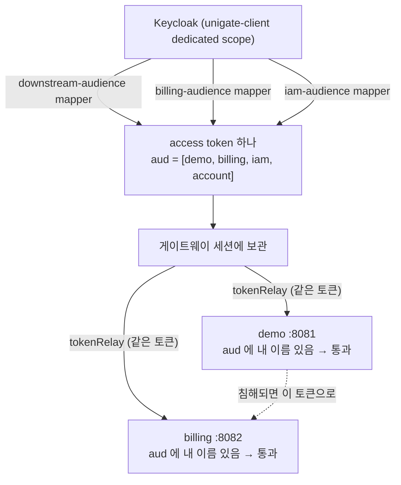

# 43. 공유 audience — 다운스트림이 둘이 되자 보인 것

> 한 줄 요약 — `aud` 검증은 "이 토큰이 나를 향했나" 만 본다. 발급자가 여러 audience 를 **한 토큰에**
> 실으면 각 서비스의 검증은 전부 통과하는데 **토큰 하나가 모든 서비스의 열쇠**가 된다.
> 관련: Phase 9+ · 코드 `samples/downstream-billing/…/AudienceValidator.kt` ·
> `scripts/keycloak/setup-realm.sh` · 검토 `docs/plans/examine/paas-iam-scope-review.md` §6.2 · §4.1

## 1. 왜 필요했나

다운스트림 샘플이 하나뿐이었다. `docs/learning/07` 에서 "Resource Server 는 기본적으로 `aud` 를
안 본다" 를 배우고 `AudienceValidator` 를 끼웠고, 그것으로 끝난 줄 알았다.

PaaS 공통 IAM 검토(`paas-iam-scope-review.md` §6.2)를 하다가 걸린 문장이 있다.

> 지금은 **공유 aud** 다. 다운스트림이 하나일 땐 안 보이지만, CCP + SECloudit + (k8s) 3개가 되면
> **하나가 뚫릴 때 전부 뚫린다.**

"안 보인다" 가 정확한 표현인지 확인하고 싶었다. 그래서 2대째 다운스트림
(`samples/downstream-billing`, :8082)을 붙였다. 목적은 기능이 아니라 **관측**이다 —
소비자가 하나면 배열의 길이가 1 이라 아무 문제로도 보이지 않는다.

## 2. 익숙한 방식과의 대조

| | 단일 서비스 (지금까지) | 다운스트림 2대 |
|---|---|---|
| `aud` 의 의미 | "나를 향한 토큰" ≈ "나만을 향한 토큰" | **둘이 다른 문장**이 된다 |
| 검증 통과의 뜻 | 이 토큰은 내 것이다 | 이 토큰은 내 것**이기도** 하다 |
| 침해 시 영향 | 그 서비스 | **같은 aud 를 공유하는 전부** |
| 고치는 자리 | 수신 측(`AudienceValidator`) | **발급 측** (수신 측에서는 못 고친다) |

세 번째 줄이 핵심이다. 수신 서비스는 자기 이름이 `aud` 에 있는지만 볼 수 있고, **그 배열에 다른
이름이 몇 개나 더 있는지는 판단 근거로 쓸 수 없다.** 남의 이름이 있다고 거절하면 정상 토큰까지
막힌다. 즉 이 문제는 검증 코드를 아무리 잘 써도 **수신 측에서 닫히지 않는다.**

## 3. 동작 원리

Keycloak 의 Audience Mapper 는 **GW client 의 dedicated scope** 에 붙는다. 그래서 그 client 가
발급하는 **모든** access token 에 그 audience 가 들어간다. mapper 를 하나 더 붙이면 값이 하나 더
늘 뿐이고, "이 요청은 billing 으로 갈 것이니 billing 만" 같은 구분은 없다 — mapper 는 요청을 모른다.



점선이 이 문서의 전부다. **demo 가 받은 토큰은 billing 의 유효한 자격증명이다.**

## 4. 직접 확인한 것

로컬에서 게이트웨이(:8080) · demo(:8081) · billing(:8082) 셋을 동시에 띄우고,
`alice`(테넌트 `acme`·`globex` 양쪽 소속)로 BFF 로그인한 뒤 확인했다.

### 4.1 한 토큰의 `aud` 가 몇 개인가

```
$ GET /api/billing/token   (X-Requested-Tenant: acme, 세션 쿠키)
{
  "audience": [
    "unigate-iam",
    "unigate-billing-demo",
    "unigate-downstream-demo",
    "account"
  ],
  "tenantMemberships": [
    "acme",
    "globex"
  ],
  "requestedTenant": "acme"
}
```

`aud` 가 **4개**다. billing 은 자기 이름(`unigate-billing-demo`)만 확인하고 통과시켰고,
그 판단은 옳다. 그런데 같은 토큰에 `unigate-downstream-demo` 도 들어 있다.

### 4.2 재생(replay) — demo 가 받은 토큰을 billing 에 그대로

`demo` 의 `/echo` 는 도착한 헤더를 되비춘다. 거기서 relay 된 `Authorization` 을 그대로 꺼내
**게이트웨이를 거치지 않고** billing(:8082)에 직접 붙였다.

```
demo 가 본 토큰 앞 12자: Bearer eyJhbGciOiJS…(마스킹)
그 토큰으로 billing 직접 호출 -> HTTP 200
{"service":"downstream-billing","audience":["unigate-iam","unigate-billing-demo","unigate-downstream-demo","account"]}
```

**200 이다.** demo 가 침해되면(또는 demo 를 운영하는 쪽이 악의적이면) 그 토큰으로 billing 의
자원에 그대로 접근할 수 있다. 두 서비스의 audience 검증은 **둘 다 정확히 동작했는데도** 그렇다.

### 4.3 claim 누출도 같은 자리에서 보인다

4.1 응답의 `tenantMemberships` 를 보면 `acme` 와 `globex` 가 **둘 다** 있다.
그런데 이 요청의 `requestedTenant` 는 `acme` 하나다.

즉 청구 서비스가 **이 사용자가 globex 에도 속한다는 사실**을 알게 된다. 이 서비스가 알아야 할
이유가 없는 정보이고, 다운스트림이 파트너·고객사 코드라면 그건 누출이다
(`paas-iam-scope-review.md` §4.1 이 지적한 그 경로).

**다운스트림이 하나였을 때도 이 값은 똑같이 실려 있었다.** 다만 비교 대상이 없어서
"소속이 넓다" 는 것이 문제로 보이지 않았을 뿐이다.

## 5. 함정 / 실패 모드

| 함정 | 증상 | 왜 헷갈리나 |
|---|---|---|
| **수신 측에서 고치려 든다** | `AudienceValidator` 를 아무리 엄격히 써도 그대로 | 배열에 내 이름이 있는지만 볼 수 있다. 남의 이름이 있다고 거절하면 정상 토큰까지 막힌다 |
| **mapper 를 라우트별로 나눌 수 있다고 생각한다** | 설정할 자리가 없다 | mapper 는 **client 의 scope** 에 붙지 요청에 붙지 않는다. 발급 시점에 목적지를 모른다 |
| **소비자가 하나일 때 검증했다고 안심한다** | 배열 길이 1 → 아무 이상 없음 | 문제의 정의상 **소비자 2대부터** 나타난다. 1대에서의 "정상" 은 검증이 아니다 |
| **`account` 를 보고 이미 공유였다고 오해** | Keycloak 기본 `account` audience | `account` 는 Keycloak 자기 API 용이라 우리 서비스끼리의 공유와 성격이 다르다. **우리가 만든 것은 2대째부터** |

> **KDoc 에 `/api/**` 를 그대로 쓰면 컴파일이 깨진다.** 이건 이 주제와 무관하지만 이 작업에서
> 실제로 밟았다 — Kotlin 블록 주석은 **중첩**되므로 그 문자열의 슬래시+별표가 주석을 하나 더 열고,
> 닫는 표시를 그 중첩분이 먹어 **파일 끝까지 주석**이 된다. 증상은 엉뚱한 줄의 `Missing '}'` 와
> EOF 의 `Unclosed comment` 라 **원인 줄이 전혀 안 보인다.** 같은 이유로 `*/` 자체도 본문에 못 쓴다.

## 6. 남은 의문

- **(b) token exchange vs (c) GW re-mint 중 무엇인가.** (b)는 Keycloak 26.2+ 가 필요한데
  이 realm 의 버전을 아직 확인하지 않았다(`paas-iam-scope-review.md` §13 미결 5). (c)는 GW 가
  **토큰 발급자**가 된다는 뜻이고, 그러면 "GW 는 인증만" 원칙이 한 칸 넘어간다.
- **(c)를 택하면 다운스트림은 Keycloak 이 아니라 GW 의 JWKS 를 본다.** 그게 실제로 어떤 운영
  부담(키 회전·JWKS 서빙)을 만드는지 해보지 않았다.
- **`account` audience 를 빼도 되는가.** 지금은 그냥 두고 있는데, 뺐을 때 Keycloak 자체 기능
  (account console 등)이 무엇을 잃는지 확인하지 않았다.
- 재생을 **탐지**할 수단은 없나. 지금은 막을 수 없다면 최소한 "demo 용 토큰이 billing 에 왔다" 를
  기록이라도 할 수 있는지 — `azp` 나 mapper 로 목적지를 표시하는 방법이 있는지 모르겠다.
