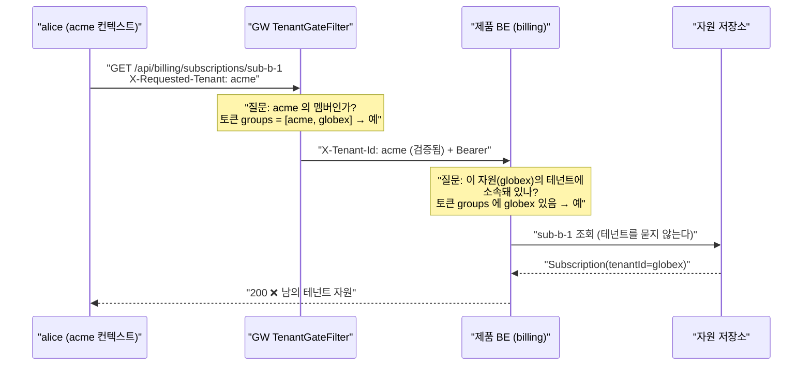

# 44. 두 검사가 각자 옳은데 합치면 구멍이다

> 한 줄 요약 — 게이트는 "요청한 테넌트의 멤버인가", 제품은 "이 자원의 테넌트에 소속돼 있나" 를
> 물었다. 둘 다 참인데 **교차 테넌트 접근이 열렸다.** 인가는 각 검사의 정답이 아니라
> **질문들이 무엇을 합쳐서 보장하는가**로 판단해야 한다.
> 관련: Phase 9+ · 코드 `samples/downstream-billing/…/SubscriptionController.kt` ·
> `gateway/…/TenantGateFilter.kt` · 검토 `docs/plans/examine/paas-iam-scope-review.md` §5.5.4

## 1. 왜 필요했나

`docs/learning/23` 에서 게이트웨이의 coarse 테넌트 게이트를 만들었고, `24` 에서 다운스트림이
**잊으면 닫히는 기본값**으로 자기 격리를 갖게 했다. 두 층이 다 있으니 테넌트 격리는 끝난 줄 알았다.

PaaS 검토 문서 §5.5.4 가 코드 조각 한 줄로 경고를 남겼다.

```kotlin
// ❌ 제품 BE — 그럴듯하고, 테스트도 통과하고, 교차 테넌트 접근이 열린다
if (jwt.tenants.contains(resource.tenantId)) allow()
```

문서는 이걸 *"리뷰에서 가장 안 잡히는 부류"* 라고만 적었다. **정말 그런지 재현해 보고 싶었다.**
그래서 2대째 다운스트림(`downstream-billing`)에 **일부러 이 판정**을 넣고,
같은 자원에 대해 규약대로 판정하는 대조군을 나란히 뒀다.

## 2. 익숙한 방식과의 대조

| | 익숙한 방식 (단일 앱 · Servlet + JPA) | 여기서의 방식 | 왜 다른가 |
|---|---|---|---|
| 인가의 주체 | 앱 하나가 전부 판단 | **게이트 + 제품** 두 층 | 층이 나뉘면 "누가 무엇을 보장하나" 가 계약이 된다 |
| 검토 단위 | 메서드 하나 | **층의 조합** | 파일 하나만 보면 둘 다 옳다 |
| 실패 형태 | 빠뜨린 검사 | **빠뜨린 검사가 없는데도 구멍** | 각자 자기 몫을 다 했다 |
| 잡는 방법 | 코드 리뷰 | 리뷰로는 안 잡힌다 → **테스트** | 아래 §5 |

세 번째 줄이 이 문서의 전부다. 지금까지 배운 인가 실패는 전부 **"뭔가를 안 했다"** 였다.
이번 것은 **"할 걸 다 했는데 열렸다"** 이고, 그래서 찾는 방법 자체가 다르다.

## 3. 동작 원리

`alice` 는 테넌트 `acme` 와 `globex` **양쪽에 속한다**(MSP·파트너·사내 devops 처럼 정상적인 요구다).
`acme` 컨텍스트로 로그인해 **`globex` 소유 자원**을 요청한다.



**두 질문 다 정답이다.** 그런데 어느 질문도 *"이 자원이 지금 들어온 스코프의 것인가"* 를 묻지 않았다.

- 게이트는 **자원을 모른다** — 라우팅 시점에 자원이 무엇인지 알 수 없다.
- 제품은 **자원을 아는데** 비교 대상을 틀렸다 — 스코프(단일 값)가 아니라 소속(목록)과 비교했다.

**목록과 비교하면 "속하기만 하면" 통과하고, 스코프와 비교하면 "지금 그 테넌트로 들어왔을 때만" 통과한다.**

## 4. 직접 확인한 것

로컬에서 GW(:8080) · demo(:8081) · billing(:8082) 을 띄우고 `alice` 로 BFF 로그인해 실행했다.
두 엔드포인트는 **같은 자원**을 보고 판정 근거만 다르다.

```
GET /api/billing/subscriptions/sub-b-1         (토큰 소속 목록 판정) -> HTTP 200
    {"id":"sub-b-1","tenantId":"globex","verdictBy":"token-memberships"}
GET /api/billing/scoped/subscriptions/sub-b-1  (검증된 스코프 판정) -> HTTP 403
GET /api/billing/scoped/subscriptions/sub-a-1  (대조군: 내 테넌트)  -> HTTP 200
    {"id":"sub-a-1","tenantId":"acme","verdictBy":"verified-scope-header"}
```

**같은 토큰 · 같은 헤더 · 같은 자원인데 판정 근거만 다르다.** 그 차이가 200 과 403 을 갈랐다.

### 4.1 게이트는 정상이었다 — 이게 중요하다

구멍이 게이트의 결함 때문이 아님을 확인해야 한다. 소속 밖 테넌트를 주장하면:

```
X-Requested-Tenant: nonmember -> HTTP 403 (게이트가 403)
```

**게이트는 자기 몫을 정확히 했다.** 즉 "게이트를 고치면 된다" 가 아니다.

### 4.2 alpha 재확인 — 그리고 하마터면 "막혔다" 고 오독할 뻔했다

alpha 에서 같은 시나리오를 돌렸다(`scripts/verify/two-downstream-scenarios.sh --env alpha`).

```
GET /api/billing/subscriptions/sub-b-1        (토큰 소속 목록) -> HTTP 200  {"id":"sub-b-1","tenantId":"demo2","verdictBy":"token-memberships"}
GET /api/billing/scoped/subscriptions/sub-b-1 (검증된 스코프)  -> HTTP 403
GET /api/billing/scoped/subscriptions/sub-a-1 (대조군)         -> HTTP 200  {"id":"sub-a-1","tenantId":"demo","verdictBy":"verified-scope-header"}
X-Requested-Tenant: nonmember                                  -> HTTP 403
```

로컬과 **완전히 같은 형태**다. 다만 `tenantId` 가 `globex` 가 아니라 `demo2` 인데, 이게 이 절의 요점이다.

#### 재현 조건이 안 맞으면 "통과" 로 위장한다

배포 전에 alpha realm 을 조회해 보니 **테넌트 이름이 로컬과 달랐다.** 픽스처를 하드코딩한 채로
올렸다면 자원의 테넌트(`globex`)가 realm 에 없고, 그러면 **아무도 거기 속하지 않으므로**
취약 엔드포인트의 `subscription.tenantId !in memberships` 가 참이 되어 **403** 이 난다.

```
기대했던 실패:  취약 200  ← 구멍이 재현됨
실제로 났을 것:  취약 403  ← "막혔다"로 읽힌다
```

**두 403 은 응답만 봐서 구분되지 않는다.** 하나는 "규약이 지켜져 막힌 것" 이고 다른 하나는
"재현 조건이 성립하지 않은 것" 인데, 후자는 **검증 실패보다 나쁘다 — 거짓 안심을 주기 때문이다.**

그래서 픽스처 테넌트를 주입받게 바꾸고(`unigate.billing.fixture.tenant-a/b`), 스크립트의 판정
기준에 이 함정을 명시했다. 재현에 필요한 조건은 **둘 다** 필요하다:

1. 두 테넌트가 realm 에 **실재**한다
2. 시나리오를 도는 계정이 **양쪽 모두에 소속**돼 있다 (한쪽만이면 같은 거짓 통과)

> **이 프로젝트에서 반복되는 형태다.** `docs/learning/40` 이 "고장내지 않으면 정책이 뒤집혀도
> 모른다" 를 다뤘다면, 여기는 **"고장을 냈는데 고장이 안 난 것처럼 보인다"** 이다.
> 음성 결과(negative result)를 볼 때는 **그것이 방어의 결과인지 조건 불충족의 결과인지**를
> 먼저 가려야 한다.

### 4.3 왜 리뷰로 안 잡히나 — 강제 지점의 차이

`downstream-demo` 와 `downstream-billing` 의 차이를 코드로 비교하면 이렇다.

| | demo | billing |
|---|---|---|
| 강제 지점 | `anyRequest` 인가 규칙 (`TenantContextAuthorizationManager`) | **파라미터를 선언한 컨트롤러에만** |
| 잊었을 때 | **닫힌다** (`learning/24`) | **그냥 안 걸린다** |

billing 의 취약 컨트롤러는 `TenantScope` 를 **선언하지 않았다.** 그래서 검증이 아예 실행되지 않는다.
"검사를 잘못했다" 가 아니라 **"검사할 기회가 없었다"** 에 가깝다 — 그리고 그건 diff 에서 안 보인다.
**없는 줄은 리뷰에 나타나지 않는다.**

## 5. 함정 / 실패 모드

| 함정 | 증상 | 왜 어려운가 |
|---|---|---|
| **소속 목록을 인가 입력으로 쓴다** | 교차 테넌트 200. 로그도 정상 | 그럴듯하고 테스트도 통과한다. 단일 테넌트 사용자로 테스트하면 **영원히 안 드러난다** |
| **"토큰과 재대조하니 안전하다" 고 믿는다** | 위조 헤더가 통과 | **양쪽 소속 사용자에게는 재대조가 통과한다.** 재대조는 GW 우회 방어이지 스코프 방어가 아니다 |
| **한 층만 보고 리뷰한다** | 각 파일이 다 옳아 보인다 | 구멍이 **층 사이**에 있다. 파일 단위 리뷰의 사각지대 |
| **강제 지점이 옵트인이다** | 새 컨트롤러가 조용히 열린다 | 선언을 잊으면 안 걸린다. `learning/24` 의 반대 형태 |

### 규약 두 줄 (§5.5.4)

1. **자원의 테넌트는 `검증된 스코프 헤더`와 비교한다.** 토큰의 소속 목록과 비교하지 않는다.
2. 소속 목록은 **"어디로 전환할 수 있는가"(스코프 스위처)** 용도이지 **인가 판단의 입력이 아니다.**

### 그런데 규약보다 강한 것이 있다

relay 토큰에 **현재 스코프 하나만** 실리면(claim 최소화) 위 취약 코드는 **애초에 쓸 수가 없다.**
`CLAUDE.md` §8 의 *"인입 `Authorization` 은 strip 후 재주입"* 과 같은 사고방식이다 —
**규약으로 막는 것보다 실을 게 없는 편이 강하다.**

## 6. 남은 의문

- **이 부류를 어떻게 자동으로 잡나.** 리뷰로 안 잡힌다면 남는 것은 테스트인데, 그 테스트는
  **양쪽 테넌트에 속한 사용자**라는 픽스처가 있어야만 의미가 있다. 단일 소속 사용자로는 우연히 통과한다.
  이 픽스처 요구를 어떻게 제품 팀에 전달할 것인가.
- **claim 최소화(현재 스코프만 relay)를 하면 "스코프 스위처" 화면은 무엇을 근거로 그리나.**
  별도 조회 API 가 필요할 텐데, 그러면 그 API 가 §4.1 의 열거 경로가 되지 않는지 확인해야 한다.
- **`X-Org-Id`·`X-Project-Id` 로 축이 늘면 이 구멍도 축마다 생기는가.** 지금은 테넌트 하나라 비교가
  단순한데, 3계층이 되면 "어느 축까지 일치해야 하나" 가 제품마다 갈릴 것 같다.
- billing 의 `/scoped/...` 대조군도 **파라미터 선언에 의존**한다. demo 처럼 `anyRequest` 로 올리면
  이 문서의 재현이 불가능해진다 — **재현 장치와 안전한 구조를 한 앱에 함께 두는 게 맞나?**
