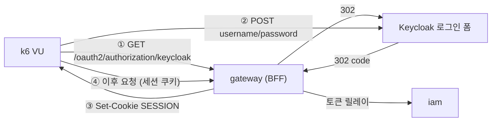

# k6 부하테스트 가이드

> 게이트웨이(BFF)와 IAM 을 대상으로 한 부하 시나리오.
> **시나리오 정의와 측정 결과는 [`SCENARIOS.md`](./SCENARIOS.md)** 에 있다. 이 문서는 실행 방법이다.
>
> k6 를 처음 쓴다면 [`docs/learning/29`](../docs/learning/29-k6-load-testing-basics.md) 를 먼저 본다 —
> 생명주기·executor·판정(check vs threshold)을 정리했다. 이 스크립트들의 설정이 왜 그렇게 되어
> 있는지가 거기서 갈린다.

## 목적(Goal)

| 시나리오 | 답하는 질문 | rate limit |
|---|---|---|
| **A** `scenario-a-ratelimit.js` | 보호 장치가 **어디서 끊는가**, 끊는 비용은 얼마인가 | 운영 기본값 |
| **B** `scenario-b-capacity.js` | 앱이 **얼마를 처리하는가**, HPA 가 제때 따라오는가 | 완화 오버레이 |

## 배경(Context) — 왜 시나리오를 나누는가

게이트웨이의 rate limit 키는 **인증 시 `sub`**(미인증이면 IP)다. 같은 사용자로 VU 를 아무리
늘려도 **버킷 하나를 공유**하므로, 운영 기본값(초당 5 보충 · 버스트 10)에서는 초당 5 요청을
넘는 순간 나머지가 429 로 튕겨 **애플리케이션에 도달하지 않는다.**

그 상태로 측정하면:

- CPU 가 오르지 않아 **HPA 가 반응하지 않는다**
- 측정되는 것은 앱 용량이 아니라 **Valkey 토큰버킷의 처리량**이다

두 질문은 서로 다르고, 답을 얻는 조건도 다르다. 그래서 나눈다.

## 설계(Design) — Bearer 토큰이 통하지 않는다



게이트웨이는 **OAuth2 Client(BFF)** 이고 Resource Server 가 아니다. `Authorization: Bearer` 를
붙여도 인증으로 취급하지 않는다 — 미인증으로 보고 401(XHR) 또는 302 를 낸다.

따라서 Keycloak Direct Access Grants 로 토큰만 받아 오는 흔한 방식은 **여기서 통하지 않고**,
`lib/session.js` 가 Authorization Code 플로우를 실제로 통과해 세션 쿠키를 얻는다.
부하테스트 전용 client 를 따로 만들 필요가 없다는 뜻이기도 하다.

## ⚠️ 세션 취급 — 이 스크립트에서 가장 틀리기 쉬운 곳

**k6 의 쿠키 jar 는 VU 가 아니라 iteration 단위로 초기화된다.**
그래서 "첫 반복에서만 로그인" 하는 흔한 패턴이 여기서는 조용히 무너진다 —
두 번째 반복부터 쿠키가 사라져 모든 요청이 401 을 받는데, **요청·응답은 계속 오가므로
처리량 그래프는 정상으로 보인다.**

`lib/session.js` 의 `ensureSession()` 이 이걸 처리한다:

```js
export default function () {
  const user = USERS[(__VU - 1) % USERS.length]
  ensureSession(BASE_URL, user.username, user.password)  // VU 당 1회 로그인 + 매 iteration 세션 주입
  ...
}
```

두 가지를 함께 해결한다:

| 문제 | 해결 |
|---|---|
| iteration 마다 쿠키가 사라진다 | 세션 값을 **VU 스코프 변수**(모듈 최상위)에 캐시해 매번 jar 에 심는다 |
| `setup()` 에서 여러 사용자를 순차 로그인하면 두 번째부터 실패 | VU 별로 로그인한다. VU 마다 jar 가 독립이라 **다른 사용자의 Keycloak SSO 세션이 섞일 자리가 없다** |

> 두 문제 모두 실제로 겪었다. 경위와 증상은 `SCENARIOS.md` 참조.

## 사전 준비

1. **k6 설치** — `brew install k6`
2. **테스트 계정** — alpha realm 은 테스트 사용자를 만들지 않는다(`CREATE_TEST_USERS=false`).
   가입 API 로 만드는 것이 가장 현실적이다. 프로필까지 생겨 `/iam/profile` 이 200 을 준다:

   ```bash
   curl -X POST "https://<gw-host>/iam/register" -H "Content-Type: application/json" \
     -d '{"email":"loadtest-01@example.com","displayName":"Load","firstName":"Load","lastName":"Test"}'
   ```

   ⚠️ 가입은 **IP 기준 rate limit**(분당 12회 · 버스트 3)이 걸려 있다. 여러 개를 만들 때는
   요청 사이에 간격을 둔다.

3. **비밀번호 설정** — 가입 API 는 비밀번호를 받지 않는다. Keycloak Admin API 로 건다:

   ```bash
   curl -X PUT -H "Authorization: Bearer $TOKEN" -H "Content-Type: application/json" \
     "$KEYCLOAK_URL/admin/realms/unigate/users/$USER_ID/reset-password" \
     -d '{"type":"password","value":"<pw>","temporary":false}'
   ```

   ⚠️ **`temporary:false` 가 핵심이다.** true 면 로그인 직후 비밀번호 변경 화면으로 넘어가
   k6 가 폼에서 멈춘다 — 증상은 "로그인 실패" 로만 보인다.

4. **결과 디렉토리** — `loadtest/results/` 는 저장소에 있다. k6 의 `handleSummary` 는
   없는 디렉토리를 만들지 않고 `could not open ...` 로 실패한다.

## 실행(Flow)

### 시나리오 A — rate limit 경계

```bash
k6 run \
  -e BASE_URL=https://<gw-host> \
  -e USERNAME=<user> -e PASSWORD=<pass> \
  loadtest/scenario-a-ratelimit.js
```

보는 것:

| 지표 | 의미 |
|---|---|
| `unigate_throttle_rate` | 429 비율. 도착률이 보충률을 넘는 구간에서 올라야 한다 |
| `unigate_ratelimit_remaining` | 남은 토큰. **중앙값이 0** 이면 버킷이 실제로 바닥까지 갔다는 뜻 |
| `http_req_duration{status:429}` | **거절 비용.** 거절이 느리면 보호 장치가 곧 부하가 된다 |

### 시나리오 B — 용량 · HPA

먼저 완화 프로파일로 배포한다:

```bash
deploy/deploy-alpha.sh --yes --skip-build --tag <기존태그> \
  --overlay deploy/helm/unigate-gateway/values-alpha-loadtest.yaml gateway

# 완화가 실제로 반영됐는지 확인 — 안 되어 있으면 측정 자체가 무의미하다
kubectl -n <ns> get deploy unigate-gateway-deploy \
  -o jsonpath='{range .spec.template.spec.containers[0].env[*]}{.name}={.value}{"\n"}{end}' \
  | grep RATELIMIT
```

```bash
# HPA 를 별도 창에서 관찰한다 — k6 요약만으로는 언제 늘었는지 알 수 없다
kubectl -n <ns> get hpa -w

k6 run \
  -e BASE_URL=https://<gw-host> \
  -e USERS='u1@example.com:pw,u2@example.com:pw' \
  -e MAX_VUS=36 \
  loadtest/scenario-b-capacity.js
```

**포화점을 찾을 때는 `SLEEP_SECONDS` 를 낮춘다.**

```bash
k6 run ... -e MAX_VUS=200 -e SLEEP_SECONDS=0 loadtest/scenario-b-capacity.js
```

기본 0.5초는 사람의 think time 을 흉내낸 값이라 **VU 당 요청률에 천장**을 만든다
(0.5s + 응답시간 ≈ VU 당 2 req/s 미만). 그 상태로 VU 만 올리면 앱이 아니라 산술이 상한을 정한다.
0으로 두면 요청률이 응답시간에만 좌우돼 **앱이 버티는 만큼만** 나간다.
2026-08-02 회차가 포화점을 찾은 것이 이 조건이다(`SCENARIOS.md`).

**테스트가 끝나면 오버레이 없이 다시 배포해 원래 값으로 되돌린다.**
완화된 동안 게이트웨이는 사실상 무방비다.

## 예외/에러 처리(Error Handling)

| 증상 | 원인 | 확인 |
|---|---|---|
| `로그인 폼을 찾지 못했습니다 (status=404)` | 앞선 로그인의 **Keycloak SSO 세션**이 jar 에 남아 폼을 건너뛴다 | 사용자별 로그인을 VU 안에서 하는지(= `ensureSession` 사용) 확인 |
| `로그인 폼을 찾지 못했습니다` (그 외 status) | Keycloak 응답이 로그인 페이지가 아니다 | redirect_uri 등록, realm 이름, 게이트웨이 issuer 설정 |
| `로그인 실패 (자격증명 불일치)` | 계정/비밀번호 | Keycloak 콘솔에서 계정 상태 |
| `로그인 실패 (리다이렉트 설정…)` | client 의 redirect URI 에 게이트웨이 주소가 없다 | `setup-realm.sh --env alpha --alpha-host <gw-host>` |
| 비밀번호 변경 화면에서 멈춤 | 계정의 `Temporary password` 가 켜져 있다 | reset-password 를 `temporary:false` 로 다시 |
| **429 는 0인데 성공도 거의 없다** | **세션이 끊겨 전부 401** — 가장 헷갈리는 경우 | `인증이 유지된다` 검사가 실패하는지 본다. HPA CPU 가 안 오르면 백엔드 미도달 |
| `로그인 실패 (리다이렉트 설정…)` 인데 **realm 은 멀쩡하다** | 로그인은 성공했고 **착지 URL 이 바뀌었다**(FE 분리 배포 후 콘솔 호스트로 간다). 판정이 착지에 걸려 있으면 앱이 바뀔 때 같이 늙는다 | 실패 메시지의 `착지:` 를 본다. 판정은 착지가 아니라 **세션 쿠키**여야 한다 (2026-08-02, `SCENARIOS.md`) |
| **인증·429 는 정상인데 5xx 만 쏟아진다** | 다운스트림(IAM 등)이 포화돼 **Circuit Breaker 가 열렸다.** 게이트웨이가 백엔드를 부르지 않고 즉시 fallback 한다 | 응답 본문의 `reasonCode`(`iam_unavailable` 등)와 게이트웨이 로그의 `elapsedMs` 를 본다. **한 자릿수 ms 면 회로가 열린 것**이고, 그 백엔드 로그는 깨끗하다 |
| 시나리오 B 가 429 로 즉시 중단 | 완화 오버레이가 반영되지 않았다 | 위 `grep RATELIMIT` |
| `could not open 'loadtest/results/...'` | 결과 디렉토리 없음 | `mkdir -p loadtest/results` |

## 운영 고려사항(Operations)

- **성공만 검사하면 실패가 침묵한다.** `5xx가 아니다` 같은 검사는 401 에도 통과한다.
  `인증이 유지된다 (401/302 아님)` 를 반드시 넣는다 — 이 한 줄이 "성공적으로 아무것도
  측정하지 않은" 회차를 걸러낸다.
- **트레이싱 샘플링**: 운영 기본이 100% 라 부하 중에는 그 자체가 오버헤드이자 왜곡이다.
  완화 오버레이는 5% 로 낮춘다. 대신 traceId 상관관계 검증은 이 프로파일로 하지 않는다.
- **부하 발생 위치**: 로컬에서 ingress 를 통해 쏘면 인터넷 구간이 병목일 수 있다.
  수치가 낮게 나오면 클러스터 안에서(Job 으로) 한 번 더 재본다.
- **결과 파일**: `loadtest/results/` 는 커밋하지 않는다(`.gitkeep` 만 추적). 실제 호스트가 담긴다.

## 실행 순서 권장 — 본 실행 전에 스모크부터

시나리오 B 한 회차는 11분이다. 자격증명·세션 판정이 틀어져 있으면 그 11분을 통째로 날린다.
2026-08-02 회차에서 실제로 그럴 뻔했고, **2초짜리 스모크가 먼저 걸렀다**(`SCENARIOS.md`).

VU 수만큼 로그인해 `/iam/profile` 을 한두 번 치는 짧은 스크립트를 먼저 돌려
`인증이 유지된다` 와 `세션 쿠키가 생겼다` 가 100% 인지 확인한 뒤 본 실행에 들어간다.

## ⚠️ 파드를 늘리기 전에 DB 커넥션부터 계산한다

노드 여유만 보고 replica 상한을 올리면 **파드는 스케줄되는데 부팅에서 죽는다.**

```
파드 수 × 풀 크기  ≤  max_connections − superuser_reserved − (다른 워크로드)
```

이 저장소의 alpha 공유 PostgreSQL 실측(2026-08-02): `max_connections=100`,
`superuser_reserved=3` → **일반 슬롯 97개**. 풀을 명시하지 않으면 R2DBC·HikariCP 모두 **기본 10**이라,
게이트웨이 8 + IAM 6 이면 140 이 되어 소진된다.

부하 오버레이는 그래서 풀을 명시한다(GW 8×4=32 · IAM 6×5=30). 확인:

```bash
kubectl -n <ns> run pg-slot-check --rm -i --restart=Never --image=postgres:16-alpine \
  --env="PGPASSWORD=$PW" --command -- psql -h <host> -U <user> -d <db> -c \
  "SELECT current_setting('max_connections'), count(*) FROM pg_stat_activity;"
```

> ⚠️ **`minimum-idle` 을 함께 낮춰야 한다.** HikariCP 의 기본값은 `maximum-pool-size` 와 같아서,
> max 만 줄이면 놀고 있어도 최대치를 붙들고 있다.
>
> 그리고 터지는 지점은 런타임이 아니라 **부팅**이다 — R2DBC 에 마이그레이션 기능이 없어
> Flyway(JDBC)가 부팅 때 별도 커넥션을 열기 때문이다. 증상이 `CrashLoopBackOff` 라
> 부하와 연결 짓기 어렵다. 경위는 `SCENARIOS.md` 의 "IAM 스케일 회차".

## 남은 것

- **게이트웨이 자체의 상한** — 2026-08-02 에 두 번 시도했지만 두 번 다 다른 것이 먼저 막았다
  (IAM replica 1 → 공유 DB 커넥션). 셋을 다 풀자 이번엔 포화 전에 부하가 끝났다.
  더 밀려면 VU·풀 크기·replica 상한을 **함께** 설계해야 한다
- IAM 직격 시나리오(Bearer) — GW 우회 경로라 운영 경로는 아니지만 IAM 단독 용량 측정에 쓸 수 있다
- 다운스트림 경로(`/api/**`) 시나리오 — 토큰 릴레이 + audience 검증까지 포함한 전 구간

> ~~클러스터 내부에서 k6 를 Job 으로 돌리는 매니페스트~~ — **접었다(2026-08-02).**
> 로컬에서 쏜 회차의 `blocked p(95)=0ms` · `connecting p(95)=0ms` · `waiting p(95)=193ms` 가
> 지연의 99%를 서버 쪽으로 돌렸다. 인터넷 구간을 제거해서 얻을 것이 없다는 뜻이라,
> 필요해지면(부하를 더 크게 키워 로컬이 실제로 밀리면) 그때 만든다.
