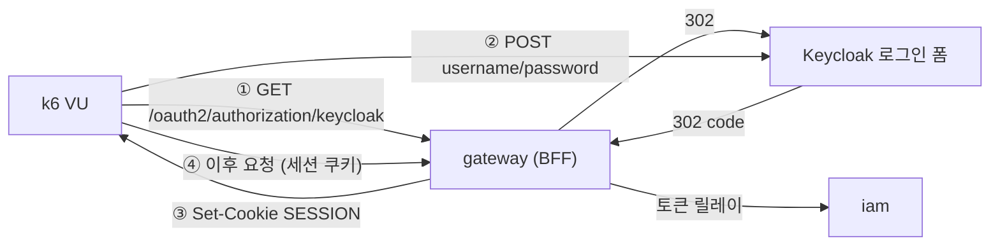

# k6 부하테스트

> 게이트웨이(BFF)와 IAM 을 대상으로 한 부하 시나리오. **시나리오를 둘로 나눈다** —
> 하나로 합치면 무엇이 병목인지 알 수 없기 때문이다.

## 목적(Goal)

| 시나리오 | 답하는 질문 | rate limit |
|---|---|---|
| **A** `scenario-a-ratelimit.js` | 보호 장치가 **어디서 끊는가**, 끊는 비용은 얼마인가 | 운영 기본값 |
| **B** `scenario-b-capacity.js` | 앱이 **얼마를 처리하는가**, HPA 가 제때 따라오는가 | 완화 오버레이 |

## 배경(Context) — 왜 나눠야 하는가

게이트웨이의 rate limit 키는 **인증 시 `sub`**(미인증이면 IP)다. 같은 사용자로 VU 를 아무리
늘려도 **버킷 하나를 공유**하므로, 운영 기본값(초당 5 보충 · 버스트 10)에서는 초당 5 요청을
넘는 순간 나머지가 429 로 튕겨 **애플리케이션에 도달하지 않는다.**

그 상태로 측정하면:

- CPU 가 오르지 않아 **HPA 가 반응하지 않는다**
- 측정되는 것은 앱 용량이 아니라 **Valkey 토큰버킷의 처리량**이다

두 질문은 서로 다르고, 답을 얻는 조건도 다르다. 그래서 나눈다.

## 설계(Design) — Bearer 토큰이 통하지 않는다



게이트웨이는 **OAuth2 Client(BFF)** 이고 Resource Server 가 아니다. `Authorization: Bearer` 를
붙여도 인증으로 취급하지 않는다 — 미인증으로 보고 401(XHR) 또는 302 를 낸다.

따라서 Keycloak Direct Access Grants 로 토큰만 받아 오는 흔한 방식은 **여기서 통하지 않고**,
`lib/session.js` 가 Authorization Code 플로우를 실제로 통과해 세션 쿠키를 얻는다.
부하테스트 전용 client 를 따로 만들 필요가 없다는 뜻이기도 하다.

## 사전 준비

1. **k6 설치** — `brew install k6`
2. **테스트 계정** — alpha realm 은 테스트 사용자를 만들지 않는다(`CREATE_TEST_USERS=false`).
   둘 중 하나로 준비한다:
   - 가입 API 로 만든다: `POST https://<gw-host>/iam/register`
   - Keycloak 관리 콘솔에서 직접 만든다(비밀번호 임시 플래그 해제 필요 —
     `Temporary` 가 켜져 있으면 로그인 직후 비밀번호 변경 화면으로 가서 **k6 가 폼에서 멈춘다**)
3. **프로필 존재 여부는 무관** — `/iam/profile` 은 프로필이 없으면 404 를 주고, 두 시나리오 모두
   404 를 정상 응답으로 센다(인증·라우팅은 성공한 것이므로).

## 실행(Flow)

### 시나리오 A — rate limit 경계

```bash
k6 run \
  -e BASE_URL=https://<gw-host> \
  -e USERNAME=<user> -e PASSWORD=<pass> \
  loadtest/scenario-a-ratelimit.js
```

보는 것:

| 지표 | 의미 |
|---|---|
| `unigate_throttle_rate` | 429 비율. 도착률이 보충률을 넘는 구간에서 올라야 한다 |
| `unigate_ratelimit_remaining` | 남은 토큰. 요청당 소모량만큼 줄어드는지 |
| `http_req_duration{status:429}` | **거절 비용.** 거절이 느리면 보호 장치가 곧 부하가 된다 |

### 시나리오 B — 용량 · HPA

먼저 완화 프로파일로 배포한다:

```bash
deploy/deploy-alpha.sh --overlay deploy/helm/unigate-gateway/values-alpha-loadtest.yaml gateway
```

```bash
# HPA 를 별도 창에서 관찰한다 — k6 요약만으로는 언제 늘었는지 알 수 없다
kubectl -n <ns> get hpa -w

k6 run \
  -e BASE_URL=https://<gw-host> \
  -e USERS='alice:pw1,bob:pw2' \
  -e MAX_VUS=60 \
  loadtest/scenario-b-capacity.js
```

**테스트가 끝나면 오버레이 없이 다시 배포해 원래 값으로 되돌린다.**
완화된 동안 게이트웨이는 사실상 무방비다.

## 예외/에러 처리(Error Handling)

| 증상 | 원인 | 확인 |
|---|---|---|
| `로그인 폼을 찾지 못했습니다` | Keycloak 응답이 로그인 페이지가 아니다 | redirect_uri 등록, realm 이름, 게이트웨이 issuer 설정 |
| `로그인 실패 (자격증명 불일치)` | 계정/비밀번호 | Keycloak 콘솔에서 계정 상태 |
| `로그인 실패 (리다이렉트 설정…)` | client 의 redirect URI 에 게이트웨이 주소가 없다 | `setup-realm.sh --env alpha --alpha-host <gw-host>` |
| 비밀번호 변경 화면에서 멈춤 | 계정의 `Temporary password` 가 켜져 있다 | Keycloak 콘솔에서 해제 |
| 시나리오 B 가 429 로 즉시 중단 | 완화 오버레이가 반영되지 않았다 | `kubectl -n <ns> exec deploy/unigate-gateway-deploy -- env \| grep RATELIMIT` |

## 운영 고려사항(Operations)

- **트레이싱 샘플링**: 운영 기본이 100% 라 부하 중에는 그 자체가 오버헤드이자 왜곡이다.
  완화 오버레이는 5% 로 낮춘다. 대신 traceId 상관관계 검증은 이 프로파일로 하지 않는다.
- **부하 발생 위치**: 로컬에서 ingress 를 통해 쏘면 인터넷 구간이 병목일 수 있다.
  수치가 낮게 나오면 클러스터 안에서(Job 으로) 한 번 더 재본다.
- **결과 파일**: `loadtest/results/` 는 커밋하지 않는다(gitignore). 실제 호스트가 담긴다.

## 남은 것

- 클러스터 내부에서 k6 를 Job 으로 돌리는 매니페스트 (네트워크 구간 제거)
- IAM 직격 시나리오(Bearer) — GW 우회 경로라 운영 경로는 아니지만 IAM 단독 용량 측정에 쓸 수 있다
- 다운스트림 경로(`/api/**`) 시나리오 — 토큰 릴레이 + audience 검증까지 포함한 전 구간
