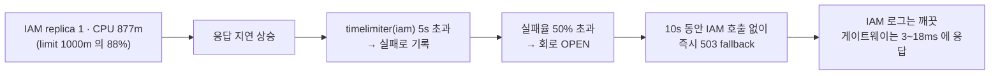

# 부하 시나리오 정의와 측정 기록

> 각 시나리오가 **무엇에 답하는지**, 어떤 조건에서 유효한지, 실제로 무엇이 나왔는지를 남긴다.
> 실행 방법은 [`README.md`](./README.md).

## 목적(Goal)

부하테스트의 결론은 숫자 하나가 아니라 **"이 숫자가 무엇을 재고 있는가"** 다.
같은 부하를 줘도 rate limit 이 켜져 있으면 토큰버킷을 재고, 세션이 끊겨 있으면 아무것도 재지 않는다.
그래서 시나리오마다 **질문 · 전제 · 무효 조건**을 함께 적는다.

---

## 시나리오 A — rate limit 경계

| | |
|---|---|
| **질문** | 보호 장치가 어디서 끊는가, 그리고 끊는 데 드는 비용은 얼마인가 |
| **스크립트** | `scenario-a-ratelimit.js` |
| **전제** | 운영 기본 설정 그대로 (완화 오버레이 **없이**) |
| **부하 모델** | `ramping-arrival-rate` — 고정 도착률. VU 기반이면 429 가 빨리 돌아오는 만큼 요청이 더 나가 "얼마를 보냈는가"가 부하 수준이 아니라 응답 속도에 좌우된다 |
| **무효 조건** | 세션이 끊기면 401 만 세게 된다. `인증이 유지된다` 검사로 방어 |

### 부하 프로파일

| 구간 | 도착률 | 의도 |
|---|---|---|
| 0~30s | 2/s | 보충률(5/s) 아래 — 전부 통과해야 한다 |
| 30~60s | 5/s | 보충률과 같음 — 경계 |
| 60s~2m | 20/s | 초과 — 429 가 지배적이어야 한다 |
| 2m~2m30s | 2/s | 회복 — 버킷이 다시 차는지 |

### 합격 기준

| 지표 | 기준 | 이유 |
|---|---|---|
| `http_req_duration{status:429}` | p(95) < 200ms | **거절이 느리면 보호 장치가 곧 부하가 된다.** rate limiter 가 장애 증폭기로 변하는 지점 |
| `http_req_failed{expected_response:true}` | rate < 0.01 | 429 는 정상 동작이라 `expected_response` 에 포함시켰다. 이걸 빼면 **정책이 잘 동작할수록 테스트가 실패**하는 거꾸로 된 판정이 된다 |

### 측정 결과 — 2026-07-28 (alpha, gateway replica 4)

```
unigate_throttled_429 ......: 632    (50.80% of 1244)
unigate_accepted_2xx .......: 612
unigate_ratelimit_remaining : avg=1.89  min=0  med=0  max=9
http_req_duration ..........: p(95)=47.95ms
  { status:429 } ...........: p(95)=25.44ms
http_req_failed ............: 0.08%
checks .....................: 100% (3734/3734)

✓ p(95)<200  →  25.44ms
✓ rate<0.01  →  0.00%
```

**읽어낸 것:**

1. **토큰버킷이 절반을 끊었다.** 도착률을 보충률 위로 올린 구간에서 50.8% 가 429.
   `remaining` 의 **중앙값이 0** 이라 버킷이 실제로 바닥까지 갔다가 회복했다.
2. **거절이 통과보다 빠르다** — 429 p95 25.44ms < 전체 p95 47.95ms.
   거절 경로가 백엔드를 타지 않고 게이트웨이에서 끝난다는 뜻이다.
3. 통과한 612건은 백엔드까지 도달했다. 같은 시각 HPA 가 `cpu: 167%/60%` 를 보고했다.

---

## ⚠️ 1차 실행이 조용히 틀렸던 기록 (2026-07-28, 같은 날 앞선 회차)

**이 회차를 지우지 않고 남긴다.** 부하테스트가 어떻게 "성공적으로 아무것도 측정하지 않을 수 있는지"
보여주는 사례이기 때문이다.

| | 1차 (결함) | 2차 (수정 후) |
|---|---|---|
| 429 | **0건** | 632건 |
| 2xx | 20건 | 612건 |
| `http_req_failed` | **92.56%** | 0.08% |
| HPA CPU | 오르지 않음 | 167%/60% |
| **checks** | **100% 통과** | 100% 통과 |

### 무슨 일이 있었나

`if (!__ITER) login(...)` — "VU 마다 한 번만 로그인" 이라는 흔한 패턴을 썼다.
그런데 **k6 의 쿠키 jar 는 VU 가 아니라 iteration 단위로 초기화된다.**
두 번째 반복부터 세션 쿠키가 사라져 모든 요청이 401 을 받았다.

### 왜 발견이 늦었나

- 요청은 계속 나가고 응답도 왔다 → 처리량 그래프는 정상으로 보인다
- **checks 가 100% 통과했다** — 당시 검사는 `429는 헤더로 사유를 준다`(429가 아니면 자동 통과)와
  `5xx가 아니다`(401도 통과) 둘뿐이었다. **성공 조건만 검사하면 실패가 침묵한다.**
- 429 가 0건인 것이 "rate limit 이 넉넉하구나" 로 오독될 수 있었다.
  실제로는 미인증 요청이라 백엔드에 도달조차 못 한 것이다.

### 고친 것

```js
// setup() 에서 한 번 로그인 → 세션 값을 뽑아 둔다
export function setup() {
  login(BASE_URL, USERNAME, PASSWORD)
  return { session: extractSessionCookie(BASE_URL) }
}

// 매 iteration 마다 jar 에 다시 심는다
export default function (data) {
  restoreSession(BASE_URL, data.session)
  ...
}
```

그리고 **회귀 방지 검사**를 추가했다:

```js
'인증이 유지된다 (401/302 아님)': (r) => r.status !== 401 && r.status !== 302,
```

---

## 시나리오 B — 용량 · HPA

| | |
|---|---|
| **질문** | 보호 장치를 걷어냈을 때 앱이 얼마를 처리하고, HPA 가 제때 따라오는가 |
| **스크립트** | `scenario-b-capacity.js` |
| **전제** | `values-alpha-loadtest.yaml` 오버레이로 **rate limit 완화** 배포 |
| **부하 모델** | `ramping-vus` — 동시 사용자 수를 올린다. 용량 측정에는 도착률보다 이쪽이 맞다 |
| **무효 조건** | 429 가 관측되면 완화가 반영되지 않은 것 → `abortOnFail` 로 **테스트를 중단**시킨다. 조용히 낮은 수치가 나오면 "용량이 이 정도구나" 로 잘못 결론 내리게 된다 |

### 사용자를 여러 명 쓰는 이유

rate limit 키가 **`sub`(인증된 사용자)** 다. 완화 후에도 한 계정에 몰면 그 계정의 버킷이 먼저 닿는다.
`USERS` 에 여러 계정을 주면 VU 가 사용자별로 나뉘어 실제 트래픽에 가까워진다.

### 합격 기준

| 지표 | 기준 |
|---|---|
| `http_req_failed{status:429}` | rate == 0 (`abortOnFail`) |
| `unigate_target_duration` | p(95) < 1000ms · p(99) < 2000ms |
| `checks` | rate > 0.99 |

### ⚠️ 이 클러스터에서의 한계 (2026-07-28 실측)

| 노드 | CPU 여유(예약 기준) | 메모리 여유 | 파드 수용 |
|---|---|---|---|
| worker-node-0 | 5m | 1.85Gi | 0개 (CPU 가 막는다) |
| worker-node-1 | 1030m | 2.33Gi | **4개** |
| worker-node-2 | 40m | 0.92Gi | 0개 (CPU 가 막는다) |

**CPU 는 물리적으로 부족한 게 아니라 예약만 꽉 차 있다** — 노드 CPU 실사용은 6~8% 인데
requests 로는 94~99% 가 잡혀 있다(다른 워크로드의 over-request). 메모리는 실사용도 61~87% 라
실제로 쓰이고 있다.

그래서:

- 파드가 **전부 worker-node-1 에 몰린다.** "스케일아웃이 동작하는가"는 볼 수 있지만
  **노드 분산 효과는 측정할 수 없다.** `podAntiAffinity` 를 걸면 아예 스케줄되지 않는다.
- HPA 상한 4는 임의값이 아니라 **메모리에서 나온 수**다(2.33Gi ÷ 512Mi).

### 측정 결과 — 2026-07-28 (alpha, 사용자 6명, 최대 36 VU, 11분)

```
요청 수 .....................: 28,270      (42.82 req/s)
iterations ..................: 28,090
실패율 ......................: 0.127%
429 발생 ....................: 0           ← 완화가 반영됐다는 증거
checks ......................: 84,342 / 0  (100%)

unigate_target_duration
  avg=31.03ms  med=28.48ms  p(90)=41.02ms  p(95)=46.33ms  max=610.15ms

✓ p(95)<1000                     →  46.33ms
✓ p(99)<2000                     →  통과
✓ http_req_failed{status:429}==0 →  0건
✓ checks rate>0.99               →  100%
```

### HPA 추이 (15초 간격 관측)

| 시각 | HPA CPU | 파드 | 국면 |
|---|---|---|---|
| 18:19:56 | 24%/60% | 2 | 웜업 |
| 18:20:58 | **257%** | 2 | 임계 초과 → 스케일아웃 트리거 |
| 18:21:43 | — | **4** | 새 파드 2개 Running |
| 18:24:47 | **400%** | 4 | 피크 (상한에 막힘) |
| 18:27:50 | 392% | 4 | 정상 상태 |
| 18:29:51 | 174% | 4 | 램프다운 |
| 18:30:52 | 36% | 4 | scaleDown 안정화 창(300s) 대기 중 |

파드별 CPU 도 함께 기록했는데(예: `dp4vq=125m`, `rwnbm=132m`), **모든 파드가 고르게 부하를
받았다.** 세션이 파드 로컬이었다면 특정 파드에만 트래픽이 몰리거나 대부분 401 이 났을 것이다 —
Valkey 공유 세션이 다중 인스턴스에서 동작한다는 실증이 시나리오 A 보다 강해졌다.

### ⚠️ 읽어낼 때 주의 — 이 수치는 "용량 한계"가 아니다

HPA 가 **400%/60%** 까지 갔는데도 replica 는 4에서 멈췄다. 상한에 막힌 것이다.
그런데 같은 구간의 응답은 **p95 46ms · 실패 0.127%** 로 멀쩡했다.

두 사실을 함께 놓으면 결론은 이렇다:

> **앱이 포화된 게 아니라 HPA 지표가 과민했다.**

`cpu request` 를 `50m` 으로 낮춘 것이 원인이다. HPA 의 utilization 은 **실사용 ÷ request** 라서,
파드당 실사용 200m 이 곧 400% 로 보인다. 노드에는 CPU 가 7코어 이상 유휴였고 응답도 빨랐다.

즉 이 회차가 측정한 것은:

- ✅ **스케일아웃이 실제로 동작한다** (2 → 4, 45초 안에 새 파드 Running)
- ✅ **완화 프로파일에서 429 가 사라진다** (0건)
- ✅ **36 VU · 42.8 req/s 를 p95 46ms 로 처리한다**
- ❌ **최대 처리량이 아니다** — 상한 4에 막혀 그 이상을 시도하지 못했다
- ❌ **노드 분산 효과가 아니다** — 파드 4개가 전부 같은 노드에 있다

최대 처리량을 알려면 노드 여유를 확보해 상한을 올리고, `request` 를 실사용에 맞게(예: 200m)
되돌려 HPA 기준을 정상화해야 한다.

> ✅ **2026-08-02 에 실제로 그렇게 했다.** 노드가 한 대 늘고 예약이 풀려 위 세 조건을 모두
> 갖춘 뒤 재측정했다 — 아래 "2026-08-02 회차".

---

## 측정 결과 — 2026-08-02 (노드 여유 확보 후 재측정)

지난 회차가 "측정하지 못했다" 고 적어 둔 세 가지를 전부 풀고 다시 쟀다.

| 조건 | 2026-07-28 | 2026-08-02 | 왜 바꿨나 |
|---|---|---|---|
| `cpu request` | 50m | **200m** | HPA utilization = 실사용 ÷ request. 50m 이면 실사용 200m 이 400% 로 보여 **앱이 아니라 지표가 먼저 포화**한다 |
| `maxReplicas` | 4 | **8** | 4는 "worker-node-1 의 메모리 여유 ÷ 512Mi" 였다. 그 제약이 사라졌다 |
| 노드 분산 | 없음(불가) | **`topologySpreadConstraints` maxSkew=1** | 지난번엔 걸면 Pending 이라 아예 못 걸었다 |

노드 여유(200m/512Mi 기준 수용 가능 파드 수)는 이렇게 회복됐다:

| 노드 | 2026-07-28 | 2026-08-02 |
|---|---|---|
| worker-node-0 | 0개 | 13개 |
| worker-node-1 | 4개 | 10개 |
| worker-node-2 | 0개 | 2개 |
| worker-node-3 | — (없던 노드) | 16개 |

### 1차 — 100 VU · think time 0.1s (11분)

```
요청 수 .....................: 205,708     (311.65 req/s)
실패율 ......................: 0%
429 발생 ....................: 0
지연 ........................: avg=98.13ms med=81.81ms p(95)=195.78ms max=2354.30ms
checks ......................: 615,822 통과 / 2 실패

부하 생성기 .................: blocked p(95)=0ms · connecting p(95)=0ms · waiting p(95)=193.37ms

✓ p(95)<1000  ✓ p(99)<2000  ✓ 429 rate==0  ✓ checks rate>0.99
```

| | 2026-07-28 | 2026-08-02 1차 |
|---|---|---|
| 처리량 | 42.82 req/s | **311.65 req/s** (7.3배) |
| p95 | 46.33ms | 195.78ms |
| 실패율 | 0.127% | **0%** |
| replica | 4 (상한에 막힘) | 2→3→5→6→**8**, Pending 0 |
| 노드 분포 | **4개 전부 node-1** | **2 / 3 / 3** (node-0·1·3) |
| HPA | 400%/60% (왜곡) | 156~195%/60% |

**읽어낸 것:**

1. **노드 분산이 실제로 걸렸다.** 8개가 `maxSkew=1` 을 지켜 2/3/3 으로 갈렸고 Pending 은 0이었다.
   지난 회차가 측정할 수 없다고 적어 둔 항목이 이번에 관측됐다.
2. **HPA 왜곡이 사라졌다.** 같은 종류의 부하에서 400% → 156~195%. request 를 실사용에 맞추자
   utilization 이 "실제로 얼마나 바쁜가" 를 가리키게 됐다.
3. **로컬 부하 생성기는 병목이 아니다** — 이건 추측이 아니라 지표로 갈렸다.
   `blocked p(95)=0ms` · `connecting p(95)=0ms` 인데 `waiting p(95)=193.37ms` 다.
   지연의 99%가 서버가 쓴 시간이므로, 클러스터 안에서 다시 쏠 이유가 없다.
   (README "남은 것" 의 **클러스터 내부 k6 Job 은 이 근거로 접었다.**)
4. **그런데 이것도 포화가 아니다.** 게이트웨이 파드당 CPU 는 ~320m(limit 1000m 의 32%)이고
   p95 도 196ms(기준 1000ms)였다. 부하가 앱을 밀어붙이지 못했다.
   가장 바쁜 것은 게이트웨이가 아니라 **IAM(686m)** 이었다 — replica 1개, HPA 없음.

> ⚠️ **스케일아웃 과도기에는 파드별 부하가 고르지 않다.** 지난 회차에 "모든 파드가 고르게
> 부하를 받았다" 고 적었는데, 이번에 새 파드가 뜨는 구간을 15초 간격으로 보니
> `998m` 과 `249m` 이 공존했다(4배). 8개가 다 Ready 가 된 뒤에는 287~336m 으로 고르게 갔다.
> **"고르게 받는다" 는 정상 상태의 성질이지 스케일아웃 중의 성질이 아니다.**

### 2차 — 200 VU · think time 0 (11분) — **여기서 무너졌다**

think time 을 0으로 두면 VU 당 요청률이 응답시간에만 좌우돼, 앱이 버티는 만큼만 나간다.

```
요청 수 .....................: 380,266     (576.17 req/s)
실패율 ......................: 21.43%
429 발생 ....................: 0
지연 ........................: avg=213.57ms med=184.76ms p(95)=475.19ms max=5115.60ms
checks ......................: 1,056,709 통과 / 81,489 실패

  인증이 유지된다 (401/302 아님) ... 379,266 / 0        ← 세션은 멀쩡했다
  rate limit 에 걸리지 않았다 ...... 379,266 / 0        ← 429 는 한 건도 없다
  5xx 가 아니다 .................... 297,777 / 81,489  ← 여기만 무너졌다

✗ checks rate>0.99   (✓ p(95)<1000 · ✓ p(99)<2000 · ✓ 429 rate==0)
```

### 무엇이 먼저 무너졌나 — 게이트웨이가 아니라 IAM

세 가지 관찰이 한 방향을 가리켰다:

1. **IAM 로그에 에러가 한 줄도 없다.** 실패한 요청이 IAM 에 **도달조차 하지 않았다**는 뜻이다.
2. **게이트웨이가 3~18ms 만에 503 을 냈다.** 백엔드를 왕복한 시간이 아니다.
   ```
   [post] GET /iam/profile status=503 SERVICE_UNAVAILABLE elapsedMs=10
   ```
3. **응답 본문이 fallback 이었다** (재현해서 직접 캡처했다):
   ```json
   {"type":"about:blank","title":"IAM Unavailable","status":503,
    "detail":"IAM 서비스가 일시적으로 응답하지 않습니다. 잠시 후 다시 시도하세요.",
    "reasonCode":"iam_unavailable"}
   ```

`reasonCode: iam_unavailable` 은 `FallbackRoutes.iamFallbackRouter` 만 내는 값이다.
즉 **IAM Circuit Breaker 가 열렸다.** 연쇄는 이렇다:



k6 가 관측한 `max=5115.60ms` 가 `timelimiter.instances.iam.timeout-duration: 5s` 와
맞아떨어지는 것이 이 연쇄의 시작점을 가리킨다.

### 그래서 576 req/s 는 무엇의 수치인가

**게이트웨이의 최대 처리량이 아니다.** 같은 구간에서 게이트웨이 파드는 400~640m
(limit 1000m)로 아직 여유가 있었다. 이 수치는 **IAM replica 1개가 정한 전 구간 상한**이다.

그리고 이 회차가 보여준 더 중요한 사실은 따로 있다:

> **포화가 장애로 번지지 않았다.** IAM 이 밀렸을 때 게이트웨이는 매달리지 않고
> 3~18ms 만에 거절했고, 세션(401 0건)과 rate limit(429 0건)은 끝까지 정상이었다.
> Circuit Breaker 가 **느린 실패를 빠른 실패로 바꿔** 게이트웨이를 보호했다 — 설계대로다.

- ✅ **노드 분산이 동작한다** (maxSkew=1 → 2/3/3, Pending 0)
- ✅ **HPA 지표 왜곡이 사라졌다** (400% → 156~195%)
- ✅ **로컬 부하 생성기는 병목이 아니다** (blocked·connecting p95 = 0ms)
- ✅ **311 req/s 를 p95 196ms · 실패 0% 로 처리한다**
- ✅ **576 req/s 에서 IAM 이 먼저 무너지고, CB 가 그것을 빠른 거절로 격리한다**
- ❌ **게이트웨이 자체의 상한은 아직 모른다** — IAM 이 먼저 막혀 그 너머를 못 봤다

다음에 게이트웨이 상한을 보려면 **IAM 을 먼저 스케일**해야 한다(request 정상화 + HPA).
IAM 을 1개로 둔 채 게이트웨이만 늘리는 것은 이 경로에서 아무 의미가 없다.

> ✅ **같은 날 그렇게 했다.** 그리고 **또 다른 것이 먼저 무너졌다** — 아래 "IAM 스케일 회차".

---

## 측정 결과 — 2026-08-02 (IAM 스케일) · 진짜 상한은 DB 커넥션이었다

IAM 에도 request 정상화(200m) + HPA(2~6) + 노드 분산을 넣고 **같은 부하**(200 VU · think time 0)를
다시 걸었다. 부하 조건을 그대로 둔 것은 **IAM 스케일의 효과만 분리**하기 위해서다.

### 3차 — IAM 스케일, 풀 기본값 그대로 (실패한 회차)

```
✗ checks rate>0.99

  요청 수      : 385150 (583.53 req/s)
  실패율       : 12.63%      ← 21.43% 에서 줄었지만 여전히 실패
  지연         : avg=210.8ms p(95)=439.57ms max=5799.23ms
```

병목은 실제로 **이동했다.** IAM 은 6개로 늘어 파드당 110~316m 로 여유가 생겼고,
대신 게이트웨이가 `1008m`(limit 1000m)에 닿았다. 여기까지는 의도한 대로였다.

**그런데 게이트웨이 파드 3개가 `CrashLoopBackOff` 였다.**

```
unigate-gateway-deploy-...-75nmr  0/1  CrashLoopBackOff  6
unigate-gateway-deploy-...-g94kg  0/1  CrashLoopBackOff  6
unigate-gateway-deploy-...-kd5nc  0/1  CrashLoopBackOff  6
```

```
FATAL: remaining connection slots are reserved for roles with the SUPERUSER attribute
SQL State  : 53300
	at org.flywaydb.core.internal.jdbc.JdbcUtils.openConnection(JdbcUtils.java:71)
	at org.flywaydb.core.FlywayExecutor.execute(FlywayExecutor.java:136)
	at org.springframework.boot.autoconfigure.flyway.FlywayMigrationInitializer.afterPropertiesSet
```

공유 PostgreSQL 을 실측해 보니:

```sql
SELECT current_setting('max_connections'), count(*) FROM pg_stat_activity;
-- max_connections=100 · superuser_reserved=3  →  일반 슬롯 97개
```

풀 기본값(둘 다 10)을 그대로 둔 산술은 이랬다:

| | 파드 | 풀 | 커넥션 |
|---|---|---|---|
| 게이트웨이 | 8 | R2DBC 10 | 80 |
| IAM | 6 | HikariCP 10 | 60 |
| | | **합계** | **140 > 97** |

> **터지는 지점이 런타임이 아니라 부팅이라는 것**이 이 함정의 핵심이다.
> R2DBC 에는 마이그레이션 기능이 없어 **Flyway(JDBC)가 부팅 때 별도 커넥션**을 연다
> (`CLAUDE.md` §4). 기존 파드가 슬롯을 다 잡고 있으면 **새 파드는 기동 자체를 못 한다.**
> 증상이 "느려짐"이나 "503" 이 아니라 `CrashLoopBackOff` 라 **부하와 연결되지 않는다.**

그래서 이 회차의 수치는 전부 다시 읽어야 한다:

- replica 8 이 아니라 **실제로는 5개**가 처리했다
- "게이트웨이가 limit 에 닿았다"(1008m)는 8개가 아니라 **5개 기준**이었다
- 12.63% 실패도 IAM 이 아니라 **파드 결손**이 상당 부분이다

### ⚠️ 관측이 이 실패를 놓쳤다

1차 회차 관측 스크립트에는 `ready=N/M` 과 `pending` 이 있었는데, IAM 을 추가하며 개편할 때
**Ready 수를 빼버렸다.** 그 결과 노드 분포 칸에 `3 8m6s` 라는 값이 찍혔지만
(비정상 파드는 `kubectl get pods -o wide` 의 컬럼이 밀린다) 파싱 잡음으로 넘겼다.

`desired=8` 은 **HPA 가 원하는 수**일 뿐 일하는 파드 수가 아니다. 지금은 다시 넣었다:

```
16:02:31 | GW 246%/60% want=8 8/8 restarts=0 bad=0 | IAM 165%/60% want=6 6/6 restarts=0 bad=0
```

### 4차 — 풀 크기를 명시하고 다시 (통과한 회차)

```yaml
# gateway
SPRING_R2DBC_POOL_MAX_SIZE: "4"        # 8 × 4 = 32
SPRING_R2DBC_POOL_INITIAL_SIZE: "2"
# iam
SPRING_DATASOURCE_HIKARI_MAXIMUM_POOL_SIZE: "5"   # 6 × 5 = 30
SPRING_DATASOURCE_HIKARI_MINIMUM_IDLE: "2"
```

> ⚠️ **Hikari 의 `minimum-idle` 기본값은 `maximum-pool-size` 와 같다** — 놀고 있어도 최대치를
> 붙들고 있다. max 만 줄이고 min 을 두면 절반만 고친 것이다.

```
✓ http_req_failed{status:429} rate==0   ✓ checks rate>0.99
✓ p(95)<1000                            ✓ p(99)<2000

  요청 수      : 323899 (490.75 req/s)
  실패율       : 0%
  429 발생     : 0
  지연         : avg=249.92ms med=201.73ms p(95)=593.85ms max=6988.44ms
  checks       : 969094 통과 / 3 실패
  부하 생성기  : blocked p(95)=0ms · connecting p(95)=0ms · waiting p(95)=551.81ms
```

부하 중 DB 를 실측해 산술이 맞는지 확인했다:

```
db          | count
unigate_iam |  31      ← IAM 6파드 × 5 + 측정용 psql 1
unigate     |  23      ← GW 8파드 × 4 상한 중 실사용
(bg)        |   5
총 59 / 100                여유 41
```

같은 시점의 파드 건강:

```
GW  246%/60% want=8 8/8 restarts=0 bad=0   nodes 2/3/3   CPU 333~594m
IAM 165%/60% want=6 6/6 restarts=0 bad=0   nodes 2/2/2   CPU 254~470m
```

전 구간 `restarts=0`. `bad>0` 은 15:58:40 한 시점뿐이고 그건 IAM 스케일아웃 중
파드가 생성되던 과도기였다(재시작이 아니다).

### ⚠️ 처리량이 줄었는데 결과는 나아졌다 — 빠른 실패는 처리량을 부풀린다

| 회차 | 구성 | req/s | 실패율 | 판정 |
|---|---|---|---|---|
| 2차 | GW 8 · IAM 1 | 576.17 | 21.43% | IAM CB 열림 |
| 3차 | GW 8(실제 5) · IAM 6 · 풀 기본값 | **583.53** | 12.63% | GW 3개 CrashLoop |
| **4차** | GW 8 · IAM 6 · **풀 명시** | **490.75** | **0%** | **전부 통과** |

3차가 4차보다 **처리량이 높다.** 그런데 3차는 실패한 회차다.

> **503 은 백엔드를 타지 않아 빨리 돌아온다.** 그래서 실패가 많을수록 초당 응답 수가 올라간다.
> 3차의 583 req/s 에서 실패분을 빼면 583 × 0.874 ≈ **510 req/s** 로, 4차의 490 과 비슷하다.
> **실패율을 함께 보지 않은 처리량 비교는 거꾸로 된 결론을 만든다.**

지연도 이 해석을 뒷받침한다 — 4차가 더 느리다(p95 594ms vs 439ms). 진짜로 일을 했기 때문이다.

### 이 회차가 확정한 것 / 못 한 것

- ✅ **IAM 을 스케일하면 CB 열림이 사라진다** (5xx 81,489건 → **3건**)
- ✅ **스케일 상한을 정한 것은 CPU·메모리가 아니라 DB 커넥션이었다** (max_connections=100)
- ✅ **풀을 명시하면 14개 파드가 59 슬롯으로 돈다** (실측)
- ✅ **490 req/s 를 실패 0% · p95 594ms 로 처리한다**
- ❌ **게이트웨이의 진짜 상한은 여전히 모른다** — 이번에도 포화 전에 멈췄다.
  GW 333~594m · IAM 254~470m 로 양쪽 다 limit(1000m)에 여유가 있었고 threshold 도 다 통과했다.
  더 밀려면 VU 를 올려야 하는데, 그러면 **DB 슬롯 산술을 다시 계산**해야 한다 —
  이제 상한을 정하는 자원이 하나 더 늘었다.

---

## ⚠️ 부하 스크립트도 낡는다 — 착지 URL 로 성공을 판정했던 기록 (2026-08-02)

2026-08-02 회차는 **본 실행 전에 스모크 테스트에서 막혔다.** 6개 계정 전부 이 메시지로 죽었다:

```
GoError: 로그인 실패 (리다이렉트 설정(redirect_uri) 또는 realm 구성 확인 필요) status=200
```

메시지가 realm 과 `redirect_uri` 를 가리켜 Keycloak 을 뒤지게 만든다. **거기엔 아무 문제가 없었다.**

실제로 로그인은 **성공하고 있었다.** 착지 URL 을 찍어 보니 이랬다:

```
login POST : status=200
landed url : https://<console-host>/          ← FE 콘솔
baseUrl    : https://<gateway-host>
startsWith(baseUrl) = false                   ← 판정은 여기서 갈렸다
title      : unigate 검증 콘솔
```

### 무슨 일이 있었나

`lib/session.js` 의 성공 판정이 `'로그인 후 게이트웨이로 돌아왔다': r.url.startsWith(baseUrl)` 였다.
그런데 이 스크립트가 만들어진 뒤(2026-07-28) **FE 를 분리 배포하면서 `UNIGATE_FRONTEND_BASE_URI`
가 들어왔고**(PR #47), 로그인 성공 착지가 게이트웨이 루트에서 **콘솔 호스트**로 바뀌었다.

앱은 의도대로 동작하는데 **부하테스트만 죽었다.** 그리고 실패 메시지는 엉뚱한 곳을 가리켰다.

### 고친 것

착지 URL 은 **배포 구성에 따라 바뀌는 값**이다. 판정 근거는 그 구성과 무관해야 한다 —
BFF 로그인의 결과물은 세션 쿠키이므로 그걸 본다.

```js
const ok = check(res, {
  '로그인 폼이 다시 나오지 않았다': (r) => !/kc-form-login/.test(r.body || ''),
  '게이트웨이 세션 쿠키가 생겼다': () => hasSessionCookie(baseUrl),   // ← 착지 대신 이것
})
```

실패 메시지에도 **착지 URL 을 넣었다.** 착지가 또 바뀌면 로그만 보고 바로 알 수 있다.

### 남길 교훈

시나리오 A 의 "조용히 틀렸던 기록" 과 방향이 반대라 함께 읽을 만하다.

| | 2026-07-28 (시나리오 A 1차) | 2026-08-02 (세션 판정) |
|---|---|---|
| 증상 | **통과했는데** 아무것도 측정 못 함 | **실패했는데** 앱은 멀쩡함 |
| 원인 | 성공 조건만 검사 → 실패가 침묵 | 앱이 바뀌었는데 판정이 안 따라감 |
| 교훈 | 검사에 **실패 조건**을 넣어라 | 판정 근거를 **바뀌는 값에 걸지 마라** |

> 검증 장치는 한 번 맞으면 끝이 아니다. **앱이 바뀌면 같이 늙는다.**
> 그래서 부하테스트는 본 실행 전에 **짧은 스모크**를 먼저 돌리는 편이 싸다 —
> 이번에도 11분짜리 회차를 날리기 전에 2초짜리 스모크가 먼저 걸렀다.

---

## 부수적으로 확인된 것

### Valkey 공유 세션 (Phase 6 W6)

시나리오 A 2차 실행에서 **gateway 파드 4개 · 단일 세션 · 1244 요청 · 인증 유지 100%** 를 관측했다.
Service 가 요청을 4개 파드에 분산하므로, 세션이 파드 로컬이었다면 대부분 401 이 났어야 한다.
Spring Session + Valkey 구성이 다중 인스턴스에서 동작한다는 실증이다.

> **한계**: 파드별 요청 수를 직접 세지는 않았다. 엄밀한 실측으로 남기려면
> 부하 중 파드별 지표를 함께 기록해야 한다.

### request 를 낮추면 HPA 가 과민해진다

스케줄을 통과시키려고 `cpu request` 를 `100m → 50m` 으로 낮췄더니, HPA 가 부하 직후
`cpu: 167%/60%` 로 즉시 상한까지 올라갔다. HPA 의 utilization 은 **실사용 ÷ request** 라서
request 를 낮추는 것이 곧 HPA 기준을 예민하게 만든다.

**스케줄링과 오토스케일링이 같은 값(request)을 공유하는데 요구 방향이 반대**라는 것이
이 구성의 구조적 긴장점이다. 포화된 클러스터에서는 "스케줄 통과"를 우선할 수밖에 없고,
그 대가로 HPA 판단이 왜곡된다.
